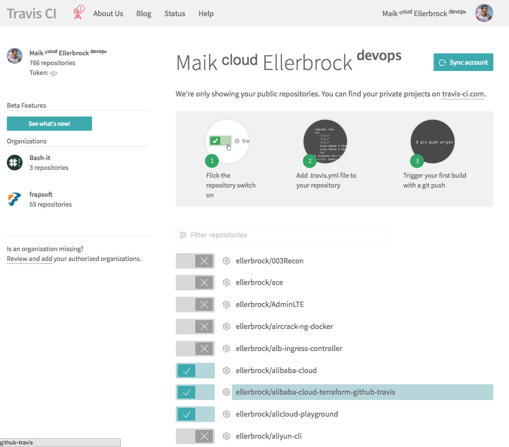
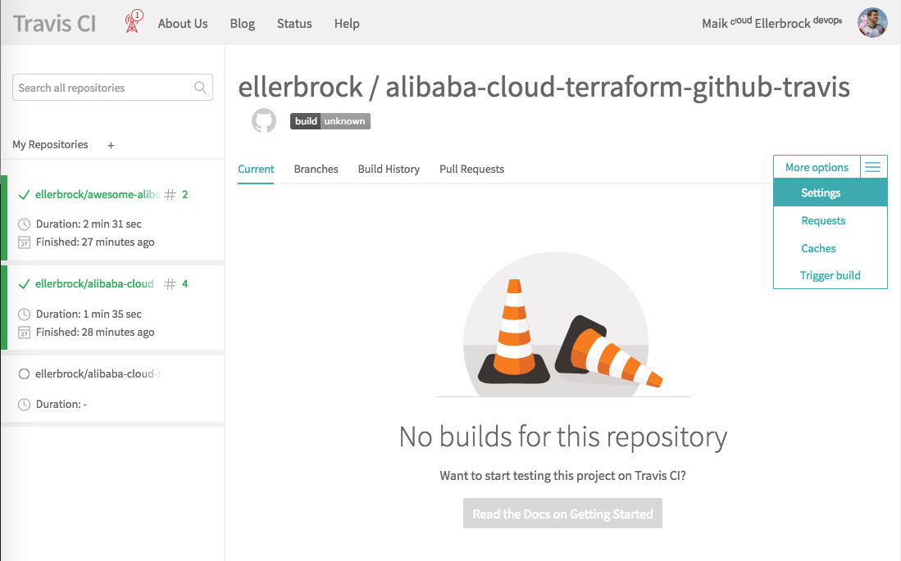
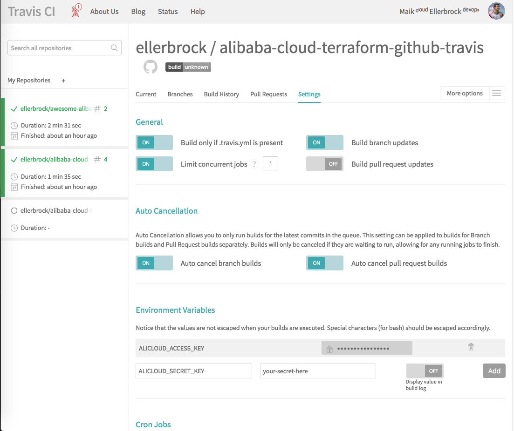

# Alibaba Cloud Infrastructure as Code Quickstart [](https://hub.docker.com/r/ellerbrock/alpine-aliyuncli/) [](https://hub.docker.com/r/ellerbrock/alpine-aliyuncli/) [](https://github.com/ellerbrock/open-source-badges/) [](https://gitter.im/frapsoft/frapsoft/)
- Official Repository: [aliyun/aliyun-cli](https://github.com/aliyun/aliyun-cli)
- Docker Hub Repository: [ellerbrock/alpine-aliyuncli](https://hub.docker.com/r/ellerbrock/alpine-aliyuncli/)
- Docker Build Repository: [ellerbrock/docker-collection](https://github.com/ellerbrock/docker-collection/blob/master/dockerfiles/alpine-aliyuncli/)

## What you need

- [Github Account](https://github.com/join)
- [Travis Account](https://travis-ci.org/) for Continuous Integration and Delivery


## Configuration

### 1.) Activate Travis for the Repository



### 2.) Go to Travis Repository Settings



Under General i have my Settings that:

- ON: Building only if .travis.yml is present
- ON: Build branch updates
- ON: Limit concurrent jobs? 1
- OFF: Build pull request updates

### 3.) Add your Credentials to Environment Variables



The Terraform Alicloud Provider Plugin expect the Environment Variables named like these:

- `ALICLOUD_ACCESS_KEY="your-key-here"`
- `ALICLOUD_SECRET_KEY="your-secret-here"`
- `ALICLOUD_REGION="your-region"`

Ensure to disable the  `Display value in build log` 

You can read in more detail about this [here](https://www.terraform.io/docs/providers/alicloud/index.html#argument-reference).

### 4.) Add `.travis.yml` to your Repo

For a clean and isolated work i choose the [Docker service](https://docs.travis-ci.com/user/docker/) for Travis CI.

Ensure to have all your commands which needs access to the encrypted environment variables from travis in the `before_script`, for whatever weird reason after you can't access them anymore e.g. via `script`. I hope this get's updated in the future.

```yml
sudo: required

language: bash

dist: trusty

group: deprecated-2017Q4

services:
  - docker

env:
  - TRAVIS_SECURE_ENV_VARS=true

before_script:
  - docker pull ellerbrock/alpine-aliyuncli
  - docker run -e "ALICLOUD_ACCESS_KEY=${ALICLOUD_ACCESS_KEY}" -e "ALICLOUD_SECRET_KEY=${ALICLOUD_SECRET_KEY}" -e "ALICLOUD_REGION=${ALICLOUD_REGION}" ellerbrock/alpine-aliyuncli

notifications:
  email:
    on_success: never
    on_failure: always
```

## Support

You can get direct support for my Open Source projects on Alibaba Cloud here

[](https://gitter.im/alibabacloudnews/Lobby)


## Try Alibaba Cloud

[Sign up](http://ow.ly/YKQe30hHgp8) today and get $300 valid for the first 60 days to try Alibaba Cloud.


## Contact

[](https://github.com/ellerbrock/)[](https://hub.docker.com/u/ellerbrock/)[](https://www.npmjs.com/~ellerbrock)[](https://twitter.com/frapsoft/)[](https://www.facebook.com/frapsoft/)[](https://plus.google.com/116540931335841862774)[](https://gitter.im/frapsoft/frapsoft/)

## License 

[](https://opensource.org/licenses/mit-license.php)

This work by <a xmlns:cc="http://creativecommons.org/ns#" href="https://github.com/ellerbrock" property="cc:attributionName" rel="cc:attributionURL">Maik Ellerbrock</a> is licensed under a <a rel="license" href="https://creativecommons.org/licenses/by/4.0/">Creative Commons Attribution 4.0 International License</a> and the underlying source code is licensed under the <a rel="license" href="https://opensource.org/licenses/mit-license.php">MIT license</a>.
